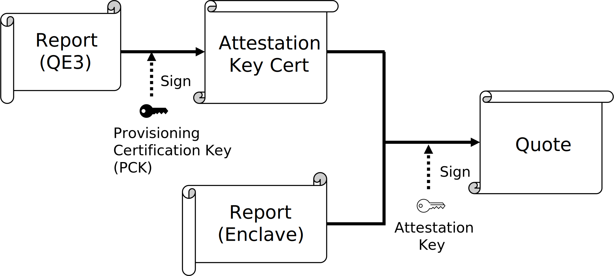
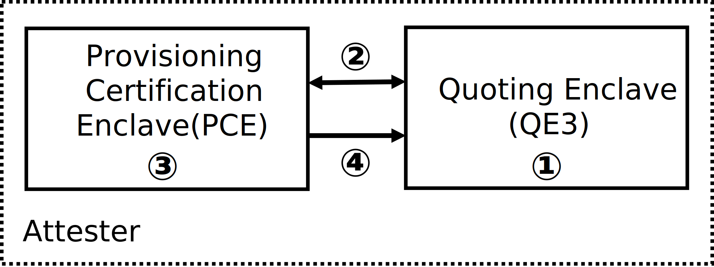
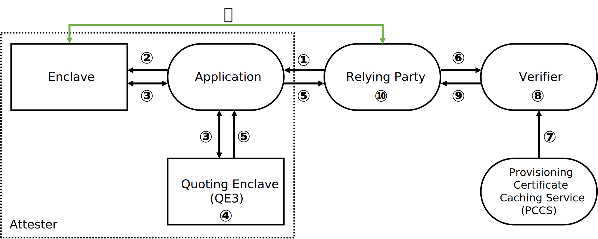

# 概要
SGXのRemote Attestationは、クラウドプラットフォーム上のSGXのハードウェアTCBとソフトウェアTCBを遠隔から評価できる機能である。[ECDSA(Elliptic Curve Digital Signature Algorithm) Attestation](https://www.intel.com/content/www/us/en/developer/articles/technical/quote-verification-attestation-with-intel-sgx-dcap.html)は、SGXのRemote Attestation方式の一つである。

この方式では、Intel以外のサードパーティが、[プラットフォームでのプロビジョニング](#プロビジョニング)と[アテステーション](#アテステーション)に必要な環境構築を行う。プロビジョニングはECDSA Attestationを利用できるようにするための準備であり、鍵の生成等を行う。アテステーションでは、プラットフォームが評価のための証拠を生成し、それをユーザーが外部サービスを使って検証することで評価を行う。

## DCAP(Data Center Attestation Primitives)
DCAPは、サードパーティがECDSA Attestationの環境構築を簡単に行えるように、Intelが[GitHub](https://github.com/intel/SGXDataCenterAttestationPrimitives)で配布しているプログラム及びソフトウェアである。これは改造して使っても良く、独自の環境を構築する場合は使わなくても良い。

## EPID Attestation(従来のリモートアテステーション)との違い

EPID(Enhanced Privacy ID) Attestationは、従来SGXで採用されていたRemote Attestation方式である。プロビジョニングとアテステーションにはどちらもIntelのソフトウェアとサービスが利用されているが、EPIDの持つ匿名性により、Intelはプライバシーを侵害しないと主張している。
これに対してECDSA Attestationでは、ソフトウェアはサードパーティ製で改変可能であり、アテステーションもサードパーティに委任されている。Intelの関与は、保証すべき部分(例:正規CPUか否か)についての情報をAPIサービスを通して配布するに留まっている。

## ユースケース
ECDSA Attestationは元々、以下のようなEPID Attestationが不都合なユースケースを想定して開発された。

1. ネットワークの大部分を、インターネットベースのサービスにアクセスできない環境(大規模イントラネット)で運用している事業者。 

2. 第三者に信頼性の判断を委託するリスクを嫌う事業者。 

3. 非常に分散して動作する特定のアプリケーションモデル（例：Peer-to-Peerネットワーク）。単一の検証ポイントを使用することは、このモデルにとって最適とは言えない。 

4. EPIDが提供するプライバシー特性と相反する要求がある環境。

しかし、最新のSGXではEPIDが廃止されているため、これら以外のケースでもECDSA Attestationを使うことになる。

# Enclave
EnclaveはSGXで保護された領域であり、この中で動くプログラムや処理されるデータの機密性と完全性は保証される。その内容は誰でも作成でき、共有ライブラリ(.so)としてロードされる。ただし、作成者を示すための署名が必須である。

## Enclave Measurement
Enclaveの識別には2つのハッシュ値、MRENCLAVE、MRSIGNERが用いられる。これらは鍵の生成や証拠の検証に利用される。  

### MRENCLAVE
Enclaveを一意に表す256bitハッシュ値である。Enclaveが初期化されてメモリ上に読み込まれると、SGXは以下を含む暗号化されたログを生成する。
- 内容：コード、データ、スタック、ヒープ
- Enclave内の各ページの配置
- 使用中のセキュリティフラグ

これらのログの値に対する256bitハッシュ値がMRENCLAVEである。

### MRSIGNER
Enclaveの署名に対応した公開鍵の256bitハッシュ値である。主にEnclaveの作成者を示す目的で使われる。MRENCLAVEよりも制約が弱くプラットフォームに値が依存しないため、デフォルトではこちらが検証で利用される。

# ハードウェア鍵とソフトウェア鍵
SGXではeFuseに焼き付けられた2種類のハードウェア鍵が利用され、これらがRoot of Trustになる。これらは主に派生鍵を生成するために利用され、eFuse外には出ない。

- Root Provisioning Key (RPK)  
Intel Key Generation Facility (iKGF)と呼ばれるIntelが所有する安全なオフライン環境下で生成される共通鍵である。この鍵はCPU出荷時に埋め込まれ、Intelは生成された全てのRPKを把握している。また、RPKをセキュリティバージョンナンバー(SVN)の更新回数だけ疑似ランダム関数(PRF)でループさせることにより、TCBと紐づいた中間値を生成することができる。

- Root Sealing Key (RSK)  
CPU内でランダムに生成される共通鍵である。Intelを含む誰もRSKの値は知らないため、この鍵から派生した鍵はそのプラットフォーム以外での模倣は非常に困難になる。

## 派生鍵
ここでは、ハードウェア鍵から派生して生成される鍵を紹介する。生成はSGX用の特殊命令であるEGETKEYで行う。全てEnclave、SVN、CPUに固有であり、同じ環境下であれば、何度呼び出しても同一の鍵を得られる。

- Provisioning Certification Key (PCK)  
RPKから派生する秘密鍵。PCKに対応する証明書はRPKを所有するIntelのみが発行可能で、配布もしている。これによりCPUが本物でTCBが適切かどうかを確認できる。

- Report Key  
RPKから派生する共通鍵。この鍵はEnclaveのメタデータであるReportを生成及び検証する際のCMACに利用される。

- Seal Key  
RSKから派生する共通鍵。この鍵は生成するEnclaveのMRENCLAVEまたはMRSIGNERに固有の値になり、Enclaveのシーリング(二次記憶装置への保存)に利用される。

なお、鍵ではないがRPKから派生する構造体にEINIT Tokenがある。これはEnclaveの起動に必要なLaunch Tokenを生成及び取得するために利用されていたが、現在Launch Tokenはデフォルトで廃止され、代替として0埋めされた構造体が渡されている。

## Attestation Key
Attestation Keyは、プラットフォームが生成する証拠であるQuoteへの署名に使うECDSA秘密鍵である。プロビジョニングでは、この鍵に対してPCKにより証明書の役割を持つ構造体が発行される。

# Local Attestation
Local Attestationは、2つのEnclave間で特定の通信を行うことで、それらが同一プラットフォーム上にある事を証明する仕組みである。

この証明には、Reportと呼ばれる構造体を利用する。Reportは、Enclaveのメタデータが含まれる構造体であり、SGX独自の命令であるEREPORT命令により生成される。この命令では、自身以外のMRENCLAVEを入力できる。Reportには、命令を呼び出したEnclaveのMRENCLAVE及びMRSIGNER、SGXのセキュリティバージョン情報、任意のユーザーデータ、入力したMRENCLAVEのReport KeyによるCMACが含まれている。

Local Attestationの流れを以下に示す。ここでは、Enclave1がLocal Attestationを要求し、Enclave2がそれに応答する。

1. Enclave1はEnclave2に対してLocal Attestationを要求する。

2. Enclave2はEnclave1に対して自身のMRENCLAVEを送信する。

3. Enclave1はEnclave2のMRENCLAVEを入力として、EREPORT命令でReport構造体を生成する。その後、ReportはEnclave2に送信される。

4. Enclave2は渡されたReportのCMACを検証するため、EGETKEY命令でReport Keyを生成する。Report KeyはプラットフォームとEnclave毎に固有であるため、この検証によってEnclave2はEnclave1が同一プラットフォーム上にあることを確認できる。その後Enclave2は、Reportに含まれたEnclave1のMRENCLAVEを入力として、EREPORT命令で新たなReportを生成し、これをEnclave1に送信する。

5. Enclave1は受信したReportのCMACを検証するため、EGETKEY命令でReport Keyを生成する。これにより、Enclave1もEnclave2が同じプラットフォーム上にあることを確認し、Local Attestationが完了する。

# 特殊なEnclave
ECDSA Attestationでは、特定の用途で使用される特殊なEnclaveが利用される。

- Provisioning Certification Enclave (PCE)  
Intel署名付きである。PCKを生成及び利用できる唯一のEnclaveであり、プロビジョニングで利用される。中間認証局と似た役割を持ち、PCKを利用してAttestation Keyに対して証明書の役割を持つ構造体(Attestation Key Cert)を発行する。

- Quoting Enclave (QE3)  
プラットフォームが生成する証拠であるQuoteを生成する役割を担い、そのためのAttestation Keyを生成及び利用するEnclaveである。なお、略称がQE3なのは、EPID AttestationのIntel製Quoting Enclaveと区別するためである。Intel署名のQE3が利用される事が多いが、サードパーティ製QE3を使う事もできる。

- Quote Verification Enclave (QvE)  
ECDSA Attestationにおいて、Quoteを検証するために利用できるEnclaveである。QvEのアイデンティティ情報はPCSから取得できる。

- Reference Launch Enclave (ref-LE)  
サードパーティが定めたホワイトリストやルールに基づいてEnclaveの起動可否を決めるためのEnclaveである。ref-LEはIntel以外のサードパーティが署名して利用する事ができ、その内容も変更する事ができる。ただし、現在デフォルトでは利用非推奨となっている。

# Quote
Quoteは、プラットフォームが生成する評価のための証拠である。QuoteはQE3によって生成され、以下のような構造になっている。

Quoteには、Attestation KeyとPCKによる署名のチェーン、及びAttestation Key Certが含まれており、署名された内容にはQE3のReport及び検証対象のEnclaveのReportが含まれている。また、QE3とPCEのセキュリティバージョンナンバー(SVN)もヘッダーに含む。

# プロビジョニング
プロビジョニングでは、アテステーションに使う鍵と証明書、つまりトラストチェーンの一部を構築する。これにはPCEとQE3を利用する。プロビジョニングフローを以下に示す。

1. QE3はAttestation Keyを生成する。

2. QE3はPCEとLocal Attestationを行った後、PCEのMRENCLAVEを入力としてReportを生成し、それとAttestation Keyを合わせてPCEに送信する。

3. PCEは受信したReportを検証した後、それらにPCKで署名する。この作成された構造体はAttestation Key Certと呼ばれ、Attestation Keyの証明書の役割を果たす。

4. PCEはAttestation Key CertをQE3に返送する。QE3はこれをEnclave内で保持する。

このフローにより、Attestation Key CertからPCK証明書、Intel CAのルート証明書までのトラストチェーンが確立され、実行時にはQuoteに対するAttestation Keyの署名からIntel CAまでのトラストチェーンを検証できるようになる。これはプラットフォーム内で完結しており、Intelの専用サービスとの通信を行うEPID Attestationのプロビジョニングとは異なる。

# アテステーション
アテステーションによって、クラウドプラットフォーム上のSGXのハードウェアTCBとソフトウェアTCBを評価できる。具体的には、CPUが正規品であること、SGXのセキュリティバージョンが一定以上であること、及び検証対象のEnclaveのMRSIGNER及びMRENCLAVEを確認できる。アテステーションフローを以下に示す。

1. ApplicationはRelying Partyからアテステーションの要求を受信する。

2. ApplicationはEnclaveに対して、自身についてのQuoteを生成するよう依頼する。

3. EnclaveはQE3とLocal Attestationを行った後、EREPORT命令でQE3のMRENCLAVEを入力としたReportを生成し、それをQE3に送信する。

4. QE3はReportを検証した後、ReportとAttestation Key Certを合わせた構造体にAttestation Keyで署名することで、Quoteを生成する。

5. QuoteはApplicationを介してRelying Partyに送信される。

6. Relying Partyは受け取ったQuoteを検証するため、Verifierにこれを送信する。

7. Verifierは、Quoteの検証に必要な情報をPCCSから取得する。

8. Verifierは取得した情報を利用して、Quoteを検証する。

9.  検証結果をRelying Partyに返信する。

10. Relying Partyは、検証結果を基にさらにRA対象EnclaveのMRENCLAVE等を確認出来る。

11. 問題がなければECDSA Attestationが完了し、セキュアチャネルが確立される。

## Quoteの検証
アテステーションで検証されるQuoteの構成は、[Quote](#quote)の項目で示した通りである。

Intelは、以下の5つの項目の検証を行えば良いとしている。
- QuoteからIntel CAまでの署名及び証明書のトラストチェーン(Intel CA-PCK-Attestation Key-Quote)は改ざんされていないか。

- 失効された署名鍵がトラストチェーンの途中に含まれていないか。

- QE3がIntelが作成したものであり最新版か。

- 証明書に示されたTCBとQuoteのTCBは一致しているか。

- 検証対象のEnclaveがQuoteに示されたものと同様か。(VerifierではなくRelying Partyが確認する事もある)

なお、CPUが正規品である事、及びPCEが適切で最新である事は、トラストチェーンの検証により証明される。PCKはRPKとPCEに固有であり、その証明書はRPKを所有しているIntelのみが発行できる。このため、PCK証明書での署名検証によって、プラットフォームでCPUの正規品である事、及び適切なバージョンのPCEが使われている事を確認できる。

検証に必要な情報は、PCCS(Provisioning Certificate Caching Service)から取得する。

## PCCS(Provisioning Certificate Caching Service)
PCCSは、Intelが配布するデータをキャッシュするためのサーバである。これはDCAPに含まれており、サードパーティが自由に構築できる。IntelはQuoteの検証に必要な情報を配布するためにPCS(Provisioning Certification Service)を運営し、APIを公開している。このAPIを利用して取得されたデータがPCCSにキャッシュされる。PCCSがキャッシュ及び配布するデータ(つまり、PCSから取得できるデータ)は以下のとおりである。

- PCK証明書
- PCKの失効リスト
- 最低限必要なSGXのセキュリティバージョン
- QE3のアイデンティティ情報
- QvEのアイデンティティ情報

### 参考
1. Scarlata, V., et al. Supporting third party attestation for Intel® SGX with Intel® data center attestation primitives. White paper(2018)., https://www.intel.com/content/dam/develop/external/us/en/documents/intel-sgx-support-for-third-party-attestation-801017.pdf
2. DCAP公式ドキュメント, https://download.01.org/intel-sgx/latest/dcap-latest/linux/docs/
3. Intel® SGX DCAP: A Quick Install Guide ,https://www.intel.com/content/www/us/en/developer/articles/guide/intel-software-guard-extensions-data-center-attestation-primitives-quick-install-guide.html
4. Code Sample: Intel® SGX Remote Attestation End-to-End Example, https://www.intel.com/content/www/us/en/developer/articles/code-sample/software-guard-extensions-remote-attestation-end-to-end-example.html
5. Quote Generation, Verification, and Attestation with Intel® SGX DCAP, https://www.intel.com/content/www/us/en/developer/articles/technical/quote-verification-attestation-with-intel-sgx-dcap.html
6. Sardar, M. U., et al. Formal foundations for intel SGX data center attestation primitives. ICFEM 2020, Proceedings 22 (pp. 268-283). ,https://dl.acm.org/doi/abs/10.1007/978-3-030-63406-3_16
